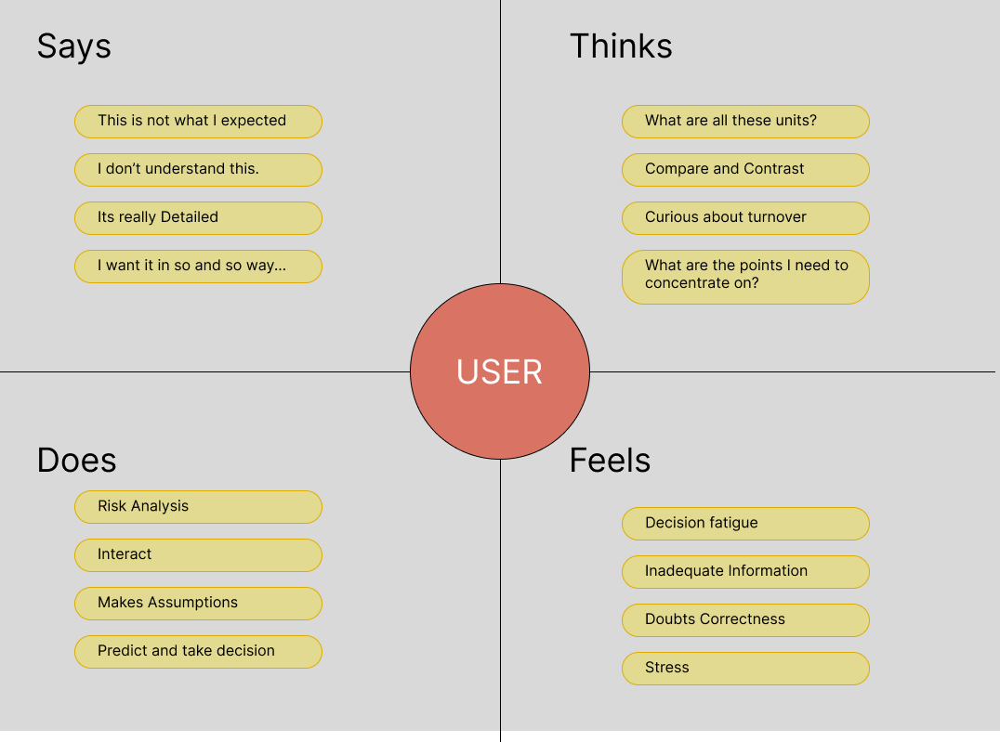

# Empathy map

- This map is created with view of the project in user's perspective, to find pain & gain points and to summarize it with a list of problem statements.

# Derived Problem Statements

- Create a simple easy to understand analytics of Sales data, by plotting different visualization.
- Use of familiar metrics to analyze data.
- Easy to find Insights of data with clear and legible color coding.
- Pleasing UI design.
- Detailed information gathering
- Localization of areas of interest, and complete analysis on them.

---
